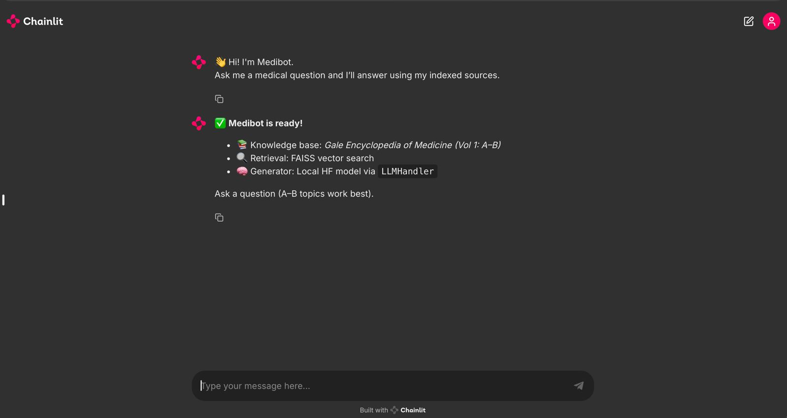
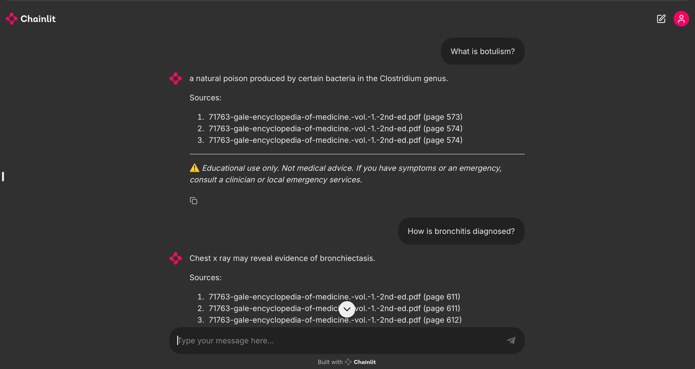
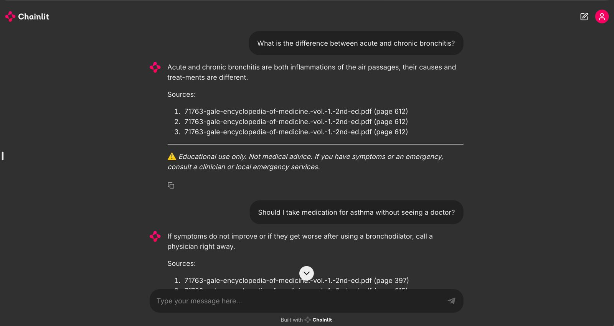

# 🏥 Medibot — Retrieval-Augmented Medical Question Answering System

Medibot is a retrieval-augmented medical question-answering system that combines semantic search with controlled language model generation to produce answers grounded in real medical sources.

Unlike generic chatbots, Medibot **retrieves first and generates second** — every response is traceable to a specific page in the source encyclopedia, not fabricated from memorized patterns.

---

## 📸 Screenshots

<div align="center">
  
  <br/><br/>
  
  <br/><br/>
  
</div>

---

## 🎯 Why Medibot Exists

Large language models are powerful — but dangerous in healthcare when they hallucinate. Medibot was built to explore how **Retrieval-Augmented Generation (RAG)** can solve this:

- **Reduce hallucinations** by forcing the model to read before it answers
- **Ground every response** in verifiable, cited medical text
- **Say "I don't know"** when information is genuinely missing
- **Build trust** through source transparency

This is an educational and research project. It demonstrates the same architectural principles used in production medical AI systems — at a scale that's clear, learnable, and reproducible.

---

## 🧠 What Medibot Does

| Capability | How |
|---|---|
| Answers medical questions | Via a conversational web interface |
| Retrieves relevant passages | Semantic search over 3,400 indexed chunks |
| Grounds responses | LLM prompt is constrained to retrieved context only |
| Cites sources | Every answer includes document name and page numbers |
| Declines gracefully | Returns a safe fallback when data is missing |
| Runs fully local | No API keys — models execute on your machine |
| Auto-detects hardware | Uses Apple Silicon MPS, NVIDIA CUDA, or CPU automatically |

---

## 📚 Knowledge Base

| Property | Value |
|---|---|
| **Source** | Gale Encyclopedia of Medicine, 2nd Edition |
| **Volume** | Volume 1 |
| **Topic Coverage** | A–B only |
| **Pages** | ~700 |
| **Indexed Chunks** | ~3,400 |
| **Vector Index** | FAISS (dense vector similarity search) |
| **Embedding Dimension** | 384 |

> ⚠️ **Scope Limitation:** The corpus covers **limited topics only**. When a question falls outside this range, Medibot responds:
> *"I am not certain based on the provided medical sources."*
>
> This behavior is intentional — not a bug.

---

## 🏗️ Architecture

```
┌──────────────────────────────────────────────────────────┐
│                      USER QUESTION                       │
└──────────────────────────┬───────────────────────────────┘
                           │
                           ▼
┌──────────────────────────────────────────────────────────┐
│                   CHAINLIT WEB UI                        │
│              (conversational interface)                  │
└──────────────────────────┬───────────────────────────────┘
                           │
                           ▼
┌──────────────────────────────────────────────────────────┐
│              FAISS VECTOR SEARCH                         |
│        semantic similarity over 3,400 chunks             │
│              retrieves top-k = 3                         │
└──────────────────────────┬───────────────────────────────┘
                           │
                           ▼
┌──────────────────────────────────────────────────────────┐
│             CONTEXT ASSEMBLY                             │
│     retrieved chunks → structured prompt                 │
└──────────────────────────┬───────────────────────────────┘
                           │
                           ▼
┌──────────────────────────────────────────────────────────┐
│           FLAN-T5 LLM GENERATION                         │
│     generates answer using ONLY retrieved context        │
└──────────────────────────┬───────────────────────────────┘
                           │
                           ▼
┌──────────────────────────────────────────────────────────┐
│              FINAL RESPONSE                              │
│         answer + source citations + disclaimer           │
└──────────────────────────────────────────────────────────┘
```

### Design Principles

| Principle | How It's Enforced |
|---|---|
| **Retrieval first** | Vector search executes before any generation step |
| **No hallucination** | Prompt explicitly restricts the model to retrieved context |
| **Source transparency** | Page numbers and document names shown with every answer |
| **Corpus awareness** | System detects and communicates when data is missing |

---

## 🛠️ Tech Stack

### Models

| Model | Role | Size |
|---|---|---|
| `sentence-transformers/all-MiniLM-L6-v2` | Converts text into 384-dimensional vectors | ~80 MB |
| `google/flan-t5-base` | Generates answers from retrieved context | ~900 MB |

### Libraries

| Library | Role |
|---|---|
| **LangChain** | Orchestrates the full RAG pipeline (retriever → prompt → LLM) |
| **FAISS** | Stores and searches 3,400 text embeddings at runtime |
| **Sentence-Transformers** | Runs the embedding model |
| **Hugging Face Transformers** | Runs Flan-T5 locally |
| **Chainlit** | Provides the interactive chat UI |
| **PyPDF** | Extracts text from the encyclopedia PDF |
| **PyTorch** | Model inference with hardware acceleration |

### Hardware Support

| Device | Supported | How |
|---|---|---|
| **Apple Silicon (M1/M2/M3)** | ✅ | PyTorch MPS — auto-detected at startup |
| **NVIDIA GPU** | ✅ | PyTorch CUDA — auto-detected at startup |
| **CPU** | ✅ | Fallback — works on any machine |

> Everything runs locally. No external APIs or paid services required. Device selection is automatic — `config.py` detects MPS, CUDA, or CPU at import time.

---

## 📂 Project Structure

```
MEDIBOT-Medical-RAG-Chatbot/
├── main.py                         # Chainlit app entry point
├── README.md                        # Project overview + setup
├── LICENSE                          # MIT License
├── .gitignore                       # Excludes data, vectorstore, logs, caches
├── requirements.txt                 # Python dependencies
├── chainlit.md                      # Chainlit welcome screen content
│
├── assets/
│   └── images/                      # Curated screenshots used in README
│
├── data/
│   ├── raw/                         # Place encyclopedia PDF here (not committed)
│   │   └── .gitkeep
│   └── processed/                   # Reserved for future preprocessing output
│       └── .gitkeep
│
├── scripts/
│   ├── build_vectorstore.py          # PDF → chunks → embeddings → FAISS index
│   ├── test_rag_quick.py             # Quick end-to-end RAG validation
│   ├── test_full_rag.py              # Full pipeline tests
│   └── diag_native_crash.py          # macOS / native dependency diagnostic
│
├── src/
│   ├── embeddings/
│   │   └── embedding_generator.py    # SentenceTransformer embedding wrapper
│   ├── ingestion/
│   │   ├── pdf_processor.py          # PDF loading + page metadata
│   │   └── text_splitter.py          # Chunking strategy
│   ├── retrieval/
│   │   └── vector_store.py           # FAISS index create/load/search
│   ├── generation/
│   │   ├── llm_handler.py            # Local Flan-T5 generation wrapper
│   │   └── prompt_templates.py       # QA prompt + citation formatting
│   └── utils/
│       ├── config.py                 # Central config + validation
│       └── logger.py                 # Logging + performance timing
│
└── vectorstore/
    └── .gitkeep                      # FAISS artifacts generated locally (not committed)
```

---

## ▶️ Setup & Usage

### 1. Create Environment

```bash
conda create -n medibot python=3.11 -y
conda activate medibot
pip install -r requirements.txt
```

### 2. Add the Medical PDF

Place the Gale Encyclopedia PDF into the raw data folder:

```bash
cp /path/to/gale_encyclopedia_vol1.pdf data/raw/
```

### 3. Build the Vector Store

This is the core preprocessing step. It reads the PDF, chunks the text, embeds every chunk, and saves a searchable FAISS index.

```bash
python scripts/build_vectorstore.py
```

Expected output:

```
Step 1/4: Processing PDF         →  ~700 pages loaded
Step 2/4: Splitting into chunks  →  ~3,400 chunks created
Step 3/4: Creating vector store  →  Embeddings generated
Step 4/4: Saving to disk         →  vectorstore/medibot_faiss_index/

✅ Vector store built successfully
```

### 4. Validate the Pipeline

Before launching the UI, run the end-to-end test to confirm retrieval and generation work together:

```bash
python scripts/test_rag_quick.py
```

If the full pipeline is working, you will see:

```
✅ RAG TEST SUCCESSFUL
```

### 5. Run the Application

```bash
chainlit run main.py
```

Open in your browser:

```
http://localhost:8000
```

---

## 💬 Example Questions

The following example queries illustrate the range of medical questions Medibot can handle, including factual retrieval, multi-step reasoning, and safe uncertainty handling:

| Example Question | What It Demonstrates |
|---|---|
| *What are the symptoms and common causes of asthma?* | Grounded factual retrieval |
| *How is bronchitis typically diagnosed?* | Evidence-based clinical explanation |
| *Explain Addison’s disease in simple terms.* | Clear medical summarization |
| *How does appendicitis usually progress if left untreated?* | Temporal and causal reasoning |
| *Can shortness of breath indicate conditions other than asthma?* | Comparative reasoning with safety awareness |
| *What are the symptoms of a condition not found in the sources?* | Correct uncertainty handling (“I don’t know” behavior) |

Every response is generated **strictly from retrieved medical sources**, includes **explicit citations**, and follows a **conservative, non-hallucinatory response policy**.

---

## 🧪 Testing

### Quick Validation

```bash
python scripts/test_rag_quick.py
```

Runs one full query end-to-end. Confirms: **load → search → generate → respond**.

### Full Pipeline Test

```bash
python scripts/test_full_rag.py
```

| Stage | What It Verifies |
|---|---|
| 1 | Vector search returns relevant chunks |
| 2 | LLM generates coherent text independently |
| 3 | Manual RAG pipeline works step by step |
| 4 | LangChain RetrievalQA chain works end-to-end |
| 5 | Edge cases and error handling are robust |

### Safety Checks

| Check | Purpose |
|---|---|
| Keyword grounding verification | Confirms answer relates to retrieved text |
| Context-overlap enforcement | Detects when model ignores context |
| Missing-data refusal | Returns safe fallback instead of guessing |
| Source tracking | Page numbers preserved from PDF through to response |

---

## ⚠️ Limitations

| Limitation | Details |
|---|---|
| **Corpus scope** | A–B topics only (Volume 1) |
| **No live data** | Static encyclopedia — no internet access |
| **Not diagnostic** | Educational use only |
| **Model size** | Flan-T5-base is lightweight; larger models produce better answers |
| **Language** | English only |
| **First query latency** | 10–30s on first run (model loading); 2–5s after that |

---

## ⚕️ Medical Disclaimer

> **Medibot is for educational and research purposes only.**
>
> It does not provide medical advice, diagnosis, or treatment recommendations. It is not a medical professional and cannot replace doctors, clinicians, or healthcare providers.
>
> **Always consult a qualified healthcare professional for any medical decisions.**

---

## 🎯 Why This Project Matters

Medibot demonstrates three principles that define responsible AI in sensitive domains:

**1. Retrieval reduces hallucination.**
By forcing the model to read relevant text before answering, fabricated responses are dramatically reduced. The model doesn't guess — it reads, then answers.

**2. Knowing when not to answer is critical.**
A system that confidently gives wrong medical information is worse than one that says "I don't know." Medibot is designed around this principle.

**3. Source transparency builds trust.**
Every answer shows exactly where it came from — document name, page number. Users can verify. That's how trust works.

These are the same principles behind production medical AI systems. Medibot applies them at a scale that's clear, reproducible, and learnable.

---

## 📄 License

MIT License — see [LICENSE](LICENSE) for details.

---

## 📬 Contact

| Platform | Link |
|---|---|
| GitHub | [Vidhikdm](https://github.com/Vidhikdm) |
| LinkedIn | [Vidhi Kadam](https://www.linkedin.com/in/vidhikadam/) |
| Email | vidhi.kadam1501@gmail.com |

---

<p align="center">
  <em>
    Built on the belief that trustworthy medical AI starts with grounded knowledge,
    transparent reasoning, and verifiable sources.
  </em>
</p>